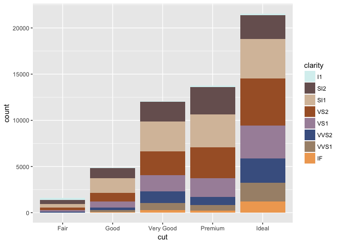
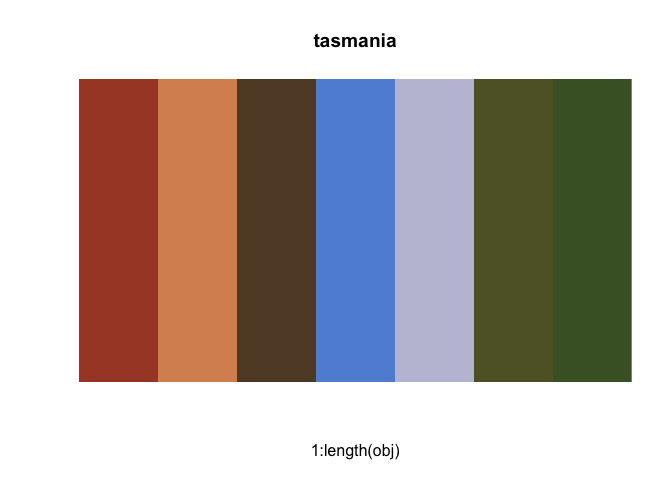

# Australia-themed Color Palettes

The goal of `ochRe` is to provide color palettes inspired by Australian themes. The palettes can be used in conjunction with `ggplot2` or `plot` to provide colors to data plots.

## Installation

You can install `ochRe` from github with:

``` r
# install.packages("devtools")
devtools::install_github("ropenscilabs/ochRe")
```

## Example

This is a basic example of how to use `ochRe` in a plot


```r
## basic example code
library(ochRe)
pal <- colorRampPalette(ochre_palettes[["olsen_seq"]])
image(volcano, col = pal(10))
```

<!-- -->

Individual palettes can be vizualized.

```r
viz_palette(ochre_palettes[["tasmania"]])
```

<!-- -->
